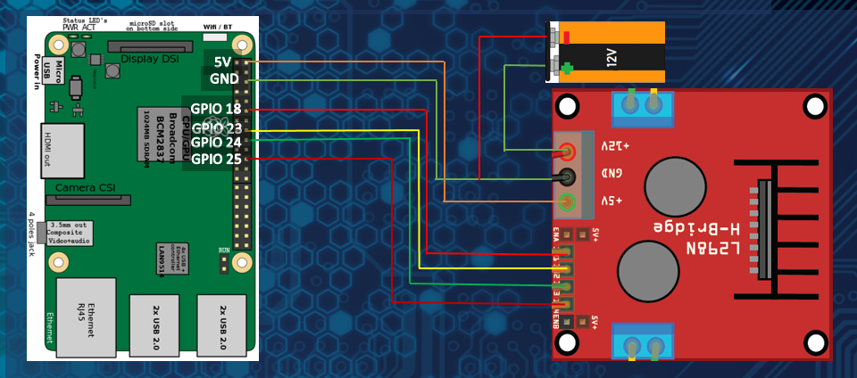
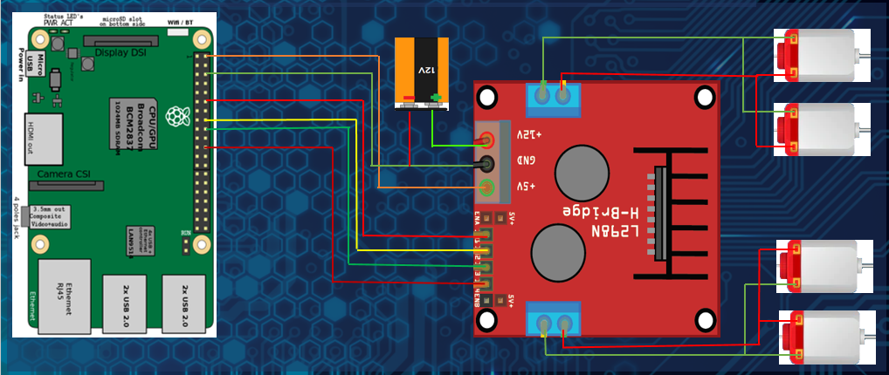
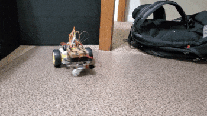

# Autonomous Car (Raspberry Pi)

## Requirements 

#### 1) Raspberry Pi 3B+
#### 2) L298N Motor Driver Module
#### 3) HC-SR04 Ultra Sonic Sensor
#### 4) 300 RPM DC Motor
#### 5) Car Chassis
#### 6) Wheels
#### 7) 12V Battery 

## Working Module - Raspberry Pi 3B+ 

### Pins Used
    1) 2 × 5-volt supply pins
    2) 2 × ground pins
    3) GPIO PIN 18
    4) GPIO PIN 23
    5) GPIO PIN 24
    6) GPIO PIN 25
    7) GPIO PIN 21
    8) GPIO PIN 26

### Connections 
    i) The 5-volt power supply with supply power to the logic boards of L298N and HCSR04.
    ii) The ground pins are used to complete the circuit of the supply pins
    iii) GPIO pins 18 and 23 are used to control the logic input pins 1 and 2 of the L298N
        which controls the forward and backward movement of the right motor.
    iv) GPIO pins 24 and 25 are used to control the logic input pins 3 and 4 of the L298N
        which controls the forward and backward movement of the left motor.
    v) GPIO pin 21 is used to set trigger the HS-SR04 which then activates itself to use its
        SONAR capabilities
    vi) GPIO pin 26 is a input pin which receives input from the HS-SR04 to get the time
        given by ultrasound ranging.

  
## Connection Module

### Part 1 - Raspberry Pi 3B to L298N
    1. Connect 5-volt output of Raspberry Pi to 5-volt input of L298N
    2. Connect GND pin of Raspberry Pi to GND pin of L298N
    3. Connect GPIO pin 18 of Raspberry Pi to Logic pin 1 of L298N
    4. Connect GPIO pin 23 of Raspberry Pi to Logic pin 2 of L298N
    5. Connect GPIO pin 24 of Raspberry Pi to Logic pin 3 of L298N
    6. Connect GPIO pin 25 of Raspberry Pi to Logic pin 4 of L298N
    7. Connect positive side of 12-volt battery to 12-volt input pin of L298N
    8. Connect negative side of 12-volt battery to GND pin of L298N
    

### Part 2 - L298N to DC motor
    1. Connect positive of DC motor 1 and 2
    2. Connect negative of DC motor 1 and 2
    3. Connect the positive wires to L298N positive part of output pin
    4. Connect the negative wires to L298N negative part of output pin
    5. Connect positive of DC motor 3 and 4
    6. Connect negative of DC motor 3 and 4
    7. Connect the positive wires to L298N positive part of output pin
    8. Connect the negative wires to L298N negative part of output pin
    

## Coding Module

Check the `Mini Project (Autonomous Car).pdf` documentation to get started.

  
## 🚀 Project in Progress.......

This Project requires further upgradation (in terms of components and code) to make it completely autonomous
using OpenCV. 

Our Final Model will look somewhat similar to this :point_down:

  
